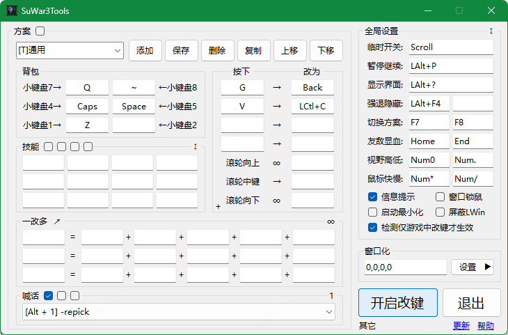
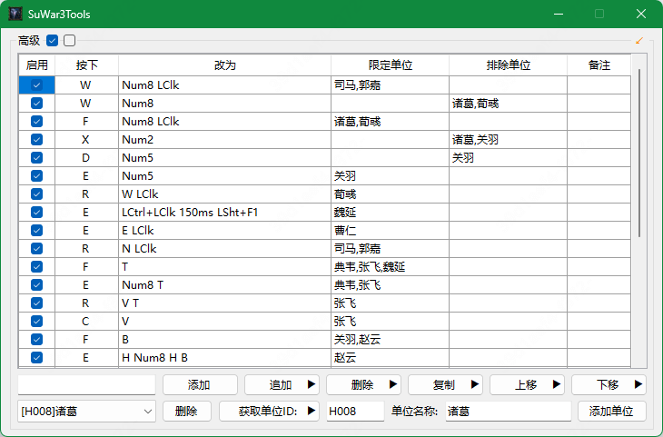

### 关于
* 主页： https://war3tools.github.io
* Github： https://github.com/war3tools/war3tools.github.io
* 

### 预览
* 主界面  

* 高级改键  

### 介绍
* 改键、显血、窗口鼠标锁定、分辨率调整，支持1.15~1.30+
* 视野调整，支持1.15~1.34，针对1.30之后的版本需要注意(1.35之后已内置视距调整功能)：
  + 调整前视野必须为地图加载完成后的初始默认值(鼠标向下滚动到视野不变为止)
  + 按下快捷键进行调整，调整过程中不要滚动鼠标滚轮，第一次大约需要6秒调整时间
  + 游戏过程中滚动鼠标会还原，可再次按下快捷键继续调整
  + 每开一局或无效时，同时按下Ctrl+视野调整快捷键重置
  + 如果调整无效时请关闭360之类的软件
* 英雄技能改键，非鼠标模式下只支持1.22-1.28，鼠标模式下支持所有版本  
以鼠标点击方式触发技能使用方法(面板从左往右从上往下一共12个格子)
  + 将鼠标放到第1格正中心后按下 Ctrl+Alt+<
  + 将鼠标放到第12格正中心后按下 Ctrl+Alt+>
  + 设置完成，配置信息自动缓存，如有问题可重设
* 显蓝：借助第三方工具实现显蓝功能
* 高级改键：点击一改多区域右边的无穷符号即可进入高级改键设置  
高级改键参考示例： [Others/AdvancedCodeDemo/README.md](https://github.com/war3tools/war3tools.github.io/blob/master/Others/AdvancedCodeDemo/README.md)
* 调用外部扩展程序：可调用第三方控制台程序并根据参数将消息以聊天形式发送  
扩展程序开发指引： [Others/SuWar3ToolsExtDemo/README.md](https://github.com/war3tools/war3tools.github.io/blob/master/Others/SuWar3ToolsExtDemo/README.md)
* 调用外部Dll注入：每次魔兽启动时可调用设置的外部Dll(如显蓝)  
注入逻辑使用指引： [Others/ExtDll/README.md](https://github.com/war3tools/war3tools.github.io/blob/master/Others/ExtDll/README.md)
* 喊话功能，如有特殊喊话需求请在高级改键里配置
* 支持Win7及以上系统(不支持XP)
* **`因程序加壳原因导致杀毒软件误报时请加入排除项即可(请完全退出360)`**
* **`请勿在对战平台上游戏时测试或使用本软件，也不要和其它改键工具同时使用`**
* **`本程序仅供学习交流，严禁用于商业用途，请于24小时内删除，作者不对因使用本软件而产生的后果和损失承担任何责任`**

### 下载
* 地址  
[https://sourceforge.net/projects/war3tools/files/](https://sourceforge.net/projects/war3tools/files/)
* 如果运行失败，请下载并安装.net 4.6.1 微软官方离线安装包：  
https://dotnet.microsoft.com/download/thank-you/net461-offline
* Bug反馈和意见及建议邮箱： war3tools@outlook.com  
  描述问题时请使用最新版本的程序测试并附带操作系统版本、魔兽版本、地图版本，以便于更方便和快速定位问题

### 更新
* [v2.1.1.154]
  + 内存优化、闪退修复及其它小优化
* [v2.1.1.153]
  + 条件表达式脚本功能移到输入框右键菜单里并增加一些脚本变量
  + 加强Http扩展服务功能
  + 其它小优化
* [v2.1.1.152]
  + 高级改键里加入条件脚本，具体使用请查看高级改键帮助文档
  + 加入内置Http服务，可供其它场景使用，具体可查看Http服务扩展帮助
  + 全局设置右下角添加插件功能入口，加入显蓝功能，请特别注意平台限制
  + 优化全局按键交换，支持按键改为鼠标，即键盘按下弹起等同于鼠标按下弹起
  + 建主机时当有新玩家加入时自动发送消息支持换行发送多条
  + 尝试优化了快捷施法锁定英雄的施法速度
  + 脚本增加了直接打开运行命令、卸载Dll的功能
  + 特定时间运行增加了检测魔兽退出时可执行相关脚本的功能
  + 记住窗口化设置添加延时，避免魔兽全屏运行时记录的值不正确
  + 修复技能面板自定义按键映射处理逻辑问题
  + 其它小优化
* [v2.1.1.151]
  + 启动平台加入“同时退出”的配置项，修复删除平台没有保存配置的问题
  + 加入全局右键菜单，快捷键为Alt+Esc，建议在魔兽窗口化运行模式下使用
  + 调整一键启动的功能移到全局右键菜单里，也可在右下角图标里设置
  + 加入快捷施法兼容双击动作的选项，适用于dota背包在自身上使用的情况
  + 高级改键加入魔兽版本、地图路径、运行参数的自定义过滤功能
  + 高级改键加入特定时间执行脚本的功能
  + 加入按键长按时只触发一次脚本的选项
  + 优化中文喊话的使用体验，降低聊天输入框的闪烁效果
  + 判断技能面板是否存在Esc由原来的100ms降为50ms
  + 修复切换方案信息不提示和小图标功能不显示的问题
  + 其它小优化
* [v2.1.1.150]
  + 扩展脚本加入按名称杀死指定进程的功能
  + 调用脚本dll注入时判断已注入则跳过，但可重复调用无参数的函数
  + 背包添加左键+Esc的功能修改为“添加左键+锁定单位”，防止选中单位丢失
  + 高级改键添追加时支持设置单位锁定，在左键上添加可防止选中单位丢失
  + 高级改键添加可通过快捷键改变另一个脚本的开启状态的功能
  + 高级改键支持添加XButton触发
  + 优化了窗口鼠标锁定功能、全屏锁鼠标支持多屏的情况
  + 优化了喊话功能，针对纯英文字符喊话特殊处理
  + 优化了Ctrl+技能学习的功能
  + 其它小优化
* [v2.1.1.149]
  + 为方便用户无界访问，更新通道改为 https://war3tools.github.io
  + 全局设置更多设置里添加通过Enter/Esc来判断聊天状态，适用于1.30+
  + 其它小优化
* [v2.1.0.148]
  + 包裹、技能等加入技能面板Esc判断，如果不存在则中断后续点击动作
  + 高级改键增加判断技能面板是否存在快捷键，如果存在则继续，否则中断
  + 添加修改按键时支持通过鼠标右键选择按键，避免键盘坏掉时无法设置
  + 优化了喊话功能的配置操作，点击喊话右边的“通用”进行更多设置
  + 窗口锁定添加位置偏移设置功能，用户可根据实际情况自行调整
  + 修复框选多个英雄时使用指定道具可能不生效的问题
  + 其它小优化
* [v2.1.0.147]
  + 优化了下1.35的改键影响聊天的情况，不一定百分百，仅提升优化
  + 增加全局键盘交换功能，在高级改键里配置要交换的键后右键选择对应选项
  + 增加外部Dll注入的功能(如显蓝)，具体参考Github帮助说明
  + 优化了扩展程序在检测War3启动时自动执行的逻辑
  + 暂停开关上加入右键设置快速启动魔兽功能选项
  + 修正了“游戏未开始也生效”的改键触发逻辑
  + 修正了创建主机后获取地图路径乱码的问题
  + 修正喊话时会按下Esc的问题
  + 其它小优化
* [v2.1.0.146]
  + 高级改键按下的键支持组合功能键的状态设置
  + 高级改键按下的键支持按下循环功能设置
  + 恢复魔兽窗口设置做了延时处理，防止卡死
  + 喊话增加多方案功能，最多支持9个喊话方案
* [v2.1.0.145]
  + 优化1.30+特殊场景下改键失效的Bug，仍无法使用可启用强制改键
  + 增加自定义按位置点判断聊天状态的功能
  + 增加一键隐藏魔兽的功能(默认未设置快捷键)
  + 增加调用外部控制台程序的功能(以09平台战绩查询为示例)
  + 增加第二种视野调整的方式(一般用于被修改过的魔兽版本)
  + 针对“英雄-F1”的功能支持可设置包含多个英雄ID并修改相关快捷键
  + 修复背包快捷键设置为组合键时的连续触发便捷性
  + 添加可自定义魔兽运行路径的功能
  + 其它小优化
* [v2.1.0.144]
  + 增加一键放下物品的扩展功能，如：Q = RClk + Drop-All
  + 技能面板等待快捷键的判断功能修正对Esc的支持
  + 魔兽启动选项可添加多组自定义启动参数
  + 修复HDPI环境下界面字体模糊的问题
* [v2.1.0.143]
  + 优化了喊话和1.30+视距调整功能
  + 高级改键加入了鼠标等待和指定技能位置等待判断
  + 全局设置里加入了记录游戏玩家名称功能(1.22-1.28)
  + 开放小图标快捷功能(1.22-1.28可提示游戏时间)
  + 提供重置版顺序改键的界面编辑功能(支持组合键)
  + 修正重置版喊话的问题
* [v2.1.0.142]
  + 显示界面的热键修改为全局可用(修改后需保存)
  + 增加窗口化功能，原分辨率设置功能移到其它面板里
  + 技能改键识别重复(IMBA)和缺少的情况(默认未开启)
  + 点击右上角关闭改为开启改键功能(兼容零度习惯)
  + 高级改键脚本可引用其它脚本并优化了操作细节
  + 高级改键可以设置技能等待(用于二三级技能连按)
  + 其它工具里加入魔兽CD-Key的修改和删除功能
  + 增加重置版顺序改键文本的编辑功能
  + 修正多屏环境下锁鼠问题和优化伪全屏处理逻辑
  + 如提示兼容性时可先开程序后开平台或强制运行
* [v2.1.0.141]
  + 增加程序标题自定义和随机文件名启动的功能
  + 高级改键增加触发指定技能位置和物品ID功能
  + 增加运行错误时的消息提示和日志处理
  + 优化英雄多选时技能改键判断
  + 检测到与平台不兼容时直接退出本程序
  + 高级改键可以复制代码便于分享
  + 增强检查更新逻辑以确保能正常更新
* [v2.1.0.140]
  + 针对1.31+的版本视距功能只支持从x86文件夹下启动魔兽有效
  + 一改多加入鼠标位置记录和还原功能，加入鼠标移动配置功能
  + 高级改键触发条件支持双击和循环触发(在按下那一列右键选择)
  + 高级改键的追加和删除操作支持操作任意位置
* [v2.1.0.139]
  + 针对技能改键的逻辑进行了调整和优化，如有问题请及时反馈
  + 加入技能重映射功能，对某个单位单独映射键值和鼠标点击
  + 一对多改键可以添加选择英雄和以鼠标方式点击技能位置
  + 高级改键里仅英雄条件下也可以设置单条规则强制有效(右键菜单 )
  + 加入强退魔兽，暂停继续游戏的快捷键
  + 加入日志记录功能，如有问题可开启后邮件反馈问题
* [v2.1.0.138]
  + 针对小键盘改键可以自由设置是否追加Esc键
  + 修正了英雄技能获取和触发的逻辑
  + 高级改键支持自定义喊话和英雄选择功能
  + 加入对IPvE vLan等其它平台的支持
  + 加入视距锁定功能(全局设置右边的入口)
  + 其它界面加入一些小功能(魔兽相关，对战平台启动)
* [v2.1.0.137]
  + 添加改键仅对英雄生效的选项设置(默认未开启)
  + 加入高级改键方案设置，可设置英雄为改键条件(仅支持1.22-1.28)
* [v2.1.0.136]
  + 优化1.30+版本宽屏的聊天状态检测逻辑
* [v2.1.0.135]
  + 优化英雄技能改键的逻辑
  + 加入屏蔽自定义按键的功能
* [v2.1.0.134]
  + 优化窗口化运行魔兽时的聊天状态判断
  + 增加游戏状态的检测，只有进入了游戏界面改键才生效
* [v2.1.0.133]
  + 增加方案快速切换功能：如名称前加“[D]”则快捷键为Ctrl+Shift+D
  + 优化魔兽1.30+版本判断聊天状态的逻辑
* [v2.1.0.132]
  + 加入更新提示框显示更新日志的功能
  + 加入鼠标模拟技能时可锁定鼠标位置

rfhCxgv0d75eY1aHezDQ+SGs9S86BuNfsxH1kjl9HTlSE5gtHBAcocq4mMomI2uDiQPXcJ9/eOCilRNG8SyFoKp8urkr2lFeEbhOeQYgoi+4ERGTyqmoEyZZqV5+mk5sXszngTdlt1biO0FhI7391h3Fu1Xj+AR2GrCP6VQRREquBeM2oucVHaG92FbQxcZiPG6hrVOy3IL+4PiRvddYuO5NoWSLWG0sVptMCODmZY/SdlEtKrLeg2ExeZd5Ul/zc8TgjmRorDIQxu+w6zk6/Q+QtwMNe70Tbvh7pMD06rstlK6KX4A6LK7haqWqD6hzJHnSRKBCfWY5zrreEEX4MxYBQHHaSYCj7rkHaEosd1fI3gfZeyYBcZWgTRWhQ5OJhMucHDVfWUpBzowGtqPZuijajPR+2zydeyYghRnZ+1LssdF0coTwTslC5RZBFMtbTlWNpz/gmY9JtBgicbwAsgVO6OZ/MdSRJBxJRYl2KDW6hpKQqy9FPrT3cQBglILFlqlAzK/aGJVgH2t8tPq1q2KYYzdXdme/FjKygE6xIB0vtdO9Ta5qXC3gyPq0TH4emfRnZs6vv+Wf7FRCQ5ipVd4IKki0jAtpWn/PZ3HWSc1qAt0cT2pLkdvfQ2LVKG25TFVlf0kHeMduPPhMMV+URTNbdU8GUcOoF4LboOxHztc8yeqhdZeAnquby5loB961TJz+c63CH707bUMNvcYLQB6BVzRGOUBxQGx96Jr5uAT96eKKYrDBr9fyIm/dgo0g8TucI7EygIPucO+xM9yy6l7ZuucDz9rXpSMour1fJXGmS9SlYRp7RvzDWzjXdIkvIG46TWWDG6wjzTXerpaM/grp1wFGpcA0hwskj+8DM6MP5jxVzPGToEUmHahp7yl4OfmfIEbWxTLpzdSmqM6a1TzfxZy2YsezkAS8kPU2QK8d3/IFpW9ESJKnwwgHR2oTakjp/UWDLv6bobjWY3NDDZDyipD8kQhKbUWrqG1/n/1BhqmGqstCBGLzfGXSvJUW4gaD+ifxBwulcQdvnE/6/u4c/Ml+w2MM7vZ9ftcu726f/sAzHGZFIx6BmKGOiTy2bnopUl8iQOrQc5HjE5BSVCbS6sUc+Fb6LbFeaCSoqevIpJH7sy/l1LV+hoDXVeeNIXMw7PkAKLhKLH50E4z9ZeJYRv8N5VQtI06QtGlQ08KTpBPKVqxcAuPUkaPWabBJPnD1gIC0l3+WG2hUY4gVFjEKNpLoY97KaOWJyZlQgkDn6crq9ZJnza1+NF/qqXvml3Wkq2lTCGznWl85kmQDpOSE+3k3oWBUw//suwrsKL93W7zKhcTembIM2ElOjQH2H5nCQO8whE8jRfPIuPCOUTW0cKTNKuXwuWAJukAtU4RdCgQ0wiwNlVClNAfNXHaKjJpyaS3kTeoeEAXRRX6bWeMLECs9u0RqEATbo0RYrP364AR3wRmGjXl6HpzzX5fjmZyV9Eonn1qosUBfSOJLYpZxRXrV1J1lFKalEH4NLWAALE2HMoIGoV21tEPza1fjDf3eqnwmP5MdMB2od6AqbkIE26rBoIlt/LcRhESmfO/qFtDnWMZH/vHl7BWie15PxVLznRg9bbOu03Xt9UH4c898irmaGrvUnnrserVl3gju2MSSLMKlHB9rAg7QDL/RGXDpGgtB6LfgcZSfpoJBGsh3JdnAaXrnO2Ww9mX7uEzKUPWPqE6Vypf3F3hTghRLOmFPrMfoewEooC5xQsagAsHgSCvjTGy+u9XfcYLpcRUA8fXOGft1fn9PpR9T3w2kpI9nbMXQ1aGflCmVBZ4JY2uOoEZYHe9qrC+qhM95cn5R2lmJpcg+DS6e/vG4MiSpS4ypmUGKAKoPzyOScX48zG5t0Uv8p+iBx87HjX1bSjW2uvIG4dJV3uRYGPhVdSE2fnV6hxFdXiC8w7P4ZVf6Xzu0rM0VSXqwTpklwYh41T/OHnCytjesPL6xG4fJG3Y/eUN+cP2XQOU6UfwPQ45EFaiVeUaltdkeBAUtV9NqMiC40dVisYwiiQm6sahc3c8w0jCG4snqyh1daIBrFpFhO7MjxZkgTen+kBBuciVqeBbBxBtsSTJ1Ium+OPL1Gvqf6dOQWo//beB+gFwUVA1rXoXUCSX8XEQE+YeNJBcZTxQ2fl5plkKEcmqeX5/E7e2hSgDHzNjB+hljuVbNIWTpfezulT61e6MpvBSC7SmSrDGKLLIbWyfEHC9jTsvj7FrZHPllTgXGxP3U1hzGJbyXU+HAdbRYu1IvTOAH7myQzZf4IzUBx1NmCzprEhj4auWPYWy4Z0LZd88LifiP87iMkaHufNgVrB7Rut2Q5nflMLNxUoC2ZOQ4kTJ9sDWAsVSK/fypLPF6SGn4zzub+1347blMfc0XBHKWNSwfgmJavznMe4WcGIRZYT8YMWO2uWaGqH85zzv7cp5gdFuqsIxNCMQj9yBEaIey/ceRP4Q8c4Z0AWRMRd/Ad2hKN6G5md/7Lv8BEaW6hM8glgcGL+B0NajKRHAXBk68NS2vNvcket+zAwZW/xKiIVVIP5cqFv3BrGVJJoPjgnKxbjV1mHX5Dmhz4SZZ/6d49moZhkAJhWmusKHGPgxMpf7T8mm0EX0CBHt82XD+FKZ3JqtOrek946HicEeWQk29Fo+kEVQneJccQXsDk2a7ASwCwmRMKJNeJTZxmGcVuwa0qiWX4d8vO8XIsLDFrlT1Ow7YcqL4Q9vuWx5GBTRu5CUpO6V+qnUyY7Qm0I7z0LR3NSxWURJvYzdokrFemxl4/2+NBXiOUVPZazmNusJI77kuslKP6AcVCsbSM4/nLOsZbGwCOwFTpToQioY8fndk6o3L/uoGXvUrcJgg+lL9LZmRON7+JI+fOOYbP07GhzpRDPZap+62pv/LPz/JVIssGB64jWOK42b3Yc0EEMKTNB3srsb9G+cwd+n+T1nP6RXwKigvnXxXRTpTv4wGShjrSA8sa28g6GjdPqZOHbIF5ApAiP3bm7fm59znNiF0T71poENE2yHg8yGd+cI/iEZfyLWoW7PFBKEN77Jay3LfF41UiN9dpucpYyAz1UXJxRvBhca68BjYXEiIGWF/3pqYLQYPI+TrWwvKpWT1wsz98hD32FgHRuxBct/FhweViy83q86SxT9y/KHmDV08Wwn/oLT+45OVLn2SV305Qg6GOF0AcLqg3XFrIiG6uaNsLe0RlKEGdbabigRYOeW50NkAHAQuM312pfCK3b4fymrUZm2d45oEf5/2ZxOHCPev2/G76ml6GOj3dJf89thHo+ZQW8kyJ8MJHzDTCX+XFmChMXHicVxZFqhVth1CXVoxZ/HPejHojM7DayJMDeeyw0fRibt3EyvHktHex84BhP2Q5MZSv05JH51JOg11lyZXTK7jKMX31xlfkpmHEDd3b0VgiKsawJ7Ll4rMOXvxMKPZtnlAkKkoQwUnibdro2roYRXqU+tUi2cU5VYKuL7hiYm3nGsEDd1UhE570jVpvVZKOlAdAPcYtf9L3xC+r1MYIAokLST85TdVplAbmNge+7M/pLizQ4NPSZbbux1xNkOfwsKiu8x7a4njetOi+kx9NEpfo2GNmVVzPCXMf5idyw1HWldSbVdQgKRO/UgI60PTMU/J73NeYMQFIk/fUUPM3Q0A4GE0jtgG/ItXtW5gZpUijwH8IS1R2iMWVg6Qexs9geKwjJBPZFmUXlwolqeSO2y0nhaPy+a3tzTWwqYBvGs5JKKZOrh9BBxP5tTKvQpYWGTELU4FZG7J7BJpE8xlyR8dFpiO05kfkjFSOKJRnKtXLF0XVGz7lRvu99jMkxTL+l/17f52pkB8Kwm7vgq+gHx+MMO7tL+wxsJninAUBDevqjlsb4sHPlCqtHbZgcRzO6GcRUwUeyY8xYNWXl2s1LqeeMmwExb5HauLDSi6OHlbAIZnyeeXxs5xuBNtov6A9PAeX7gA9zb0XnNTay42lda9M0qGmSUPFSbZ1dI9vpQ2aRXneFSG8XvdJYvJk3SEO9KKUvdEPvQIsfc+pSwpiP5vwME9kg0J1a2sWhFXGC5+CbM4TiUaKMCavXvAxbYm3DshAxaqFVrjo3JK9KdKTClcWrE+PfpKLZB+DZ+csEMwRoX1/RfDVAGcSbQfzRoBVKyOMLIqF4sxeIf2Gr0qAjD5E+4BHjyScgtsot4eiELQIFcbsyQgARoY5SOvcmrt1jNmSPPCxe5zsgH9+667Theyvfzw/OorZQcdQmof1BC8mtjBMLijhpNIMJLCSBo3bCL1AI/q6inEVezwatnUT2Q37vPdV3SXV/bNAdhvd7dFx95Z9r7n63gEShQfsDi/X9b0xcym1agKZSH4cTxNd4GkEdWUYOn2DhibHpkaoHlPZeR0sHEPy5NTPEyQp5PtigyW4OtFWlTGVtqIh5mEJB8P6tEhSeF1Bnr/24SSRJprWx82yOBIk1pxAcMNajPHcpp2jrqrC7j0TwSFCJoQIoc5B8uxcR3QSeTaaEGPeedSLt3YWmat6q/rzVElPFaOrb4+0uzlH2lLAMpVuiWyfA1dvjYrqGTW8IMHQqJ/eF4DGh1rTZMtLmm3mWbUM0JXSLhF1ckbfHV7A8J4Q5KYFssfUylpQ4gjgmLpNcJyHaQ426gB0ThUEiUSR0Z8XLTQ4XsknFoOefUE7QHVK8SMdcUajDL1Xl0XNvA3LhlIgitFIJmzhP7T6VZRjOXz859uzmD8sh8ijGYH360Dj3ip0dlvOuHpobGEz4L9LJgRpdhm1FGAg4jVUnciO10QprTtGLu0fVlIhYX+4Is61Rv+DMcI2iWZ7UCLMpXmQ17wvNppKObGissQ364n3IelbncAfWMhK1gubTMR7PHdc6ug+KMW1/y+Cqw7SfqFgp9XnLJ9mL7a0KkapkD/ywSM1W8Q07hnP3FDH9nv7iuTjfcTHefylGWR/CUO+Ngez+OINDlnMwrBHTugeqIyu6cK4IcTV7jEVGlPOvLUI1FIby1DQlNOgXa4zsL8WeT96uWq9ZmARAOvwH7ajLQcMZCEJ2x+wioj9+VkdTJGaBzIZLLwofQMewl/fFCBDawXDuXYO/PxGgseLWHUQIoRli7CnOGkT4vIeUvv1TC/1FWtmluKzV6EPUUyeUWWFevBH3xBGKTGFdowxxur4i8P9wjBMUjnqTxJ1idCb3zxLpPD9OmRuFi2I5NEb9/bSYEmFlDgQQxWePbg7JYRGeAw2otVkd+SK3yJA9BSNyAbauGQsnNJ9YXrSkrrGrEZVKtT3kHOomeA53FL+C12xODbPHyW2jfcOvfIHxbyVORu4rq8xhKNVOEjm2NBd2tj2A==

### 赞赏

如果觉得本程序对你有帮助可以在程序的赞赏入口里对我进行赞赏(金额随意)

gEt+MDdUWzPYGGhS4WAawLlUC3awXYgkrVRej8z2xkwCmnKvp22K5T46HBid9yOKtY3Y7Pt2Ng022mXhYGv8Ws4nLug62oFpCjrdTNpj+czwysHzsvPAewc1cCU6Zq8mQafwFOVQ7y8t6IaZpIxsRuW7PA/VohqG/XRB3gm/K+UKd06xXeCvLK6/tqDD6ue6wxjtLJaNgScXZXw7byrrF7nAzY4/RyXTvOi8lq6zrdkeZB7j1b7kOvo4D1a6gZVGa6CpZDCWBukR6K/cxQwYLvWJzrgsjEAD9WfelOxCwg3Plb7joRqaB2SPhqU+T8sy4c3gh6bq9mLzdyFdoneNOyu600pX/CYhSSS6UtQJgAwdwcTgRCUMilUHgpaUTCCMU2y40+oKQp4kp5bip7bkFyvNVbaTvaDU3BSCYeME2iXbwRzRDbHq+EE9fHN7XTV4fDWBfNab5AgHf70fIysXoRwRj9YeSFvyNnkm14MosZIdLX8sBowVIjOQJAzZQC7YUeLqa4tM3PIOiMceSCnyuixCcwq0uFlbAUioreZdicCze4qFhv2R0XVOu2R/+Y2fpTDQD+74J53YCrE8noFxep+AyBtmZopSWglMiTKZbcD+3Z+w2q01Phu/kVOn+Q2wFJl4oAW4XN7AREKGsvebPv3BepLe559V2QmKumHP0a5wfv6CnDNsUaM1VBKQ7upP8f0viFRQDP/gxL587arCRs5arpZiYQQ5/bgmXgwyrNmE6I/w5SBIU5CzQI5nOm9WjloO0DYDzM6BMzVJ2Eq6w0t9ozLqMXC9h7NYpUV3FRxRba4LLjCT4MFsbMd8gVO3T1i4wQK+QfKiDQyrjTapwO1eDkvVg11q/a9ZxxpQg5fQsOoiKwbG/ReMn0JEXANl0cGU8+MQCAPcQ5x93E+of01Dpo7OarWsSIAliWybs70ipmymoc0hHMBcGkfBZ/bz

